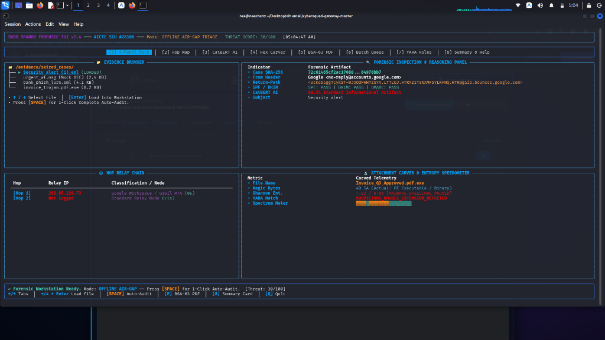
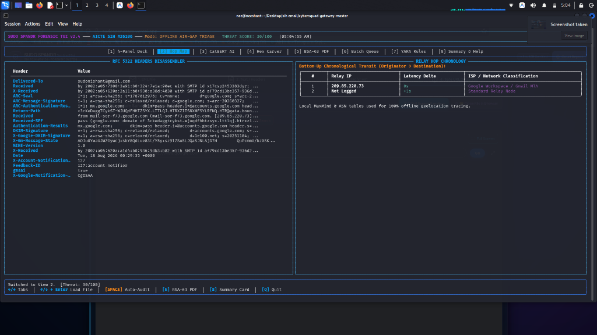
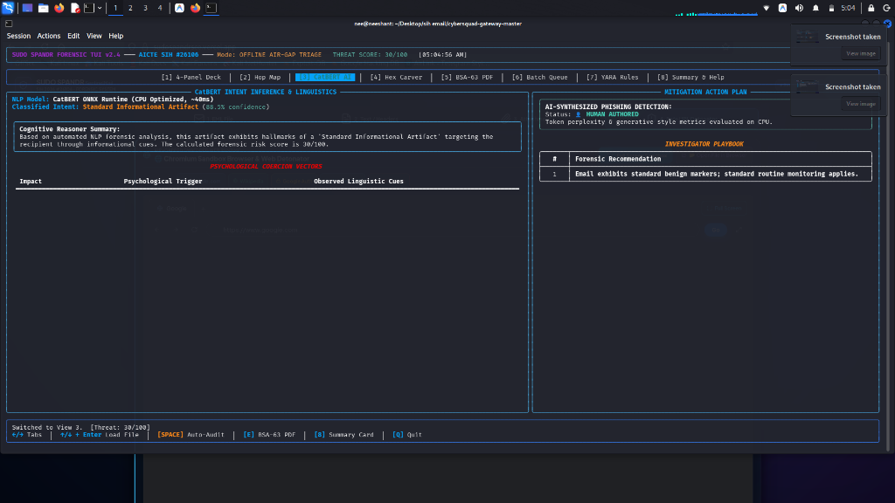
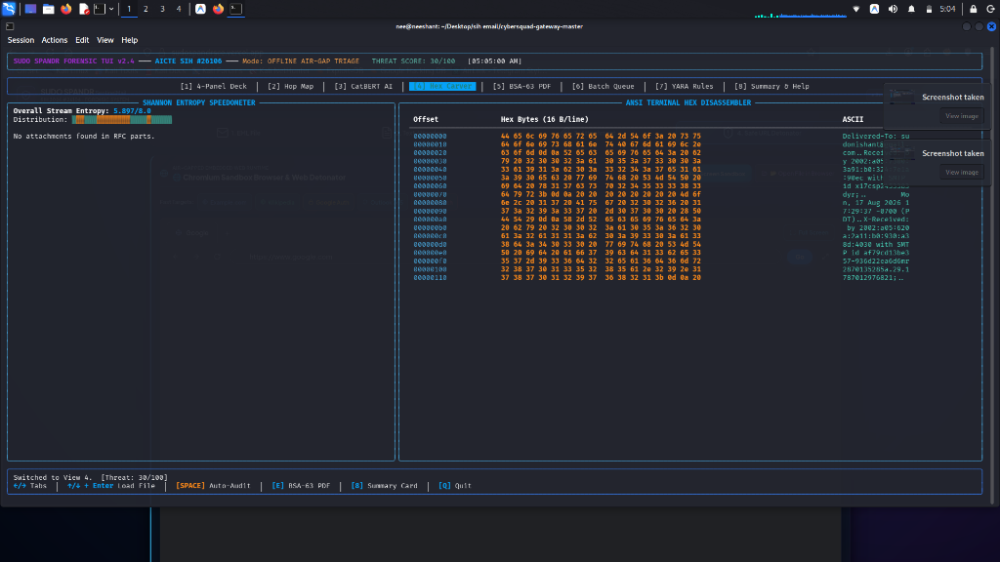
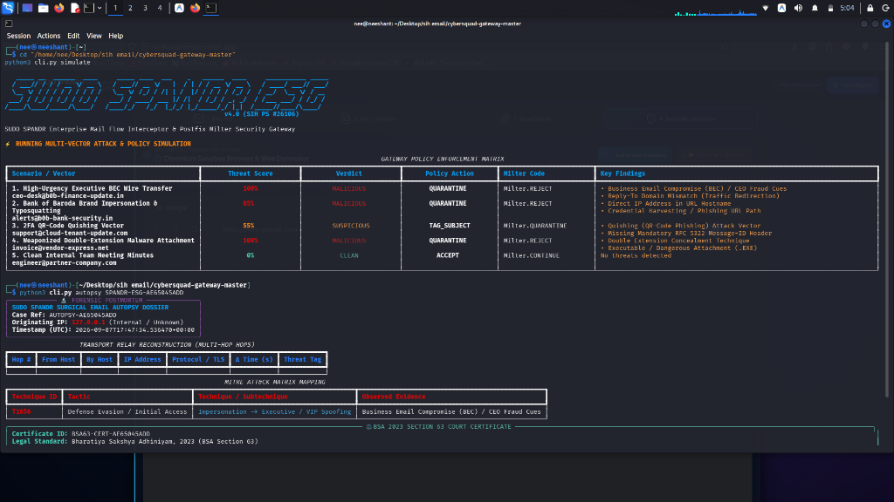

# 🛡️ SUDO SPANDR TUI — Offline Air-Gap Email Forensic Engine
### AICTE Smart India Hackathon 2026 | Problem Statement #26106
#### Sovereign Cyber Defense, Post-Mortem Dissection, True Magic Carver & Section 63 BSA 2023 Evidence Certification

<div align="center">

[](https://python.org)
[](https://www.kali.org/)
[](https://sih.gov.in)
[]()
[]()
[](LICENSE)

</div>

---

## ⚡ Live Terminal Demonstration (Terminal Animation)

<div align="center">
  
</div>

---

## 🎯 Executive Overview & Problem Statement #26106

**SUDO SPANDR TUI** is a sovereign, terminal-native digital forensics and incident response (DFIR) workstation engineered for **Law Enforcement Officers (LEOs)**, **State Cyber Crime Cells**, **CERT-In teams**, and **SOC Incident Responders**.

Traditional email security tools rely heavily on cloud APIs (VirusTotal, ANY.RUN, commercial SaaS gateways). In sovereign defense and high-stakes criminal investigations, **submitting seized electronic evidence to third-party cloud infrastructure breaches chain-of-custody, leaks state intelligence, and violates Indian evidence law**. 

**SUDO SPANDR solves this with 100% Offline Air-Gapped Reverse Engineering**, treating raw RFC 5322 email bitstreams (`.eml`, `.msg`, `.pst`) like compiled binary executables through byte-level dissection, cryptographic verification, and psychological threat profiling.

---

## 📸 Forensic Visual Walkthrough (Interactive TUI Panels)

### 1. 🎛️ Tab [1]: 4-Panel Unified Command Deck
Master operational cockpit providing immediate situational awareness across all critical forensic indicators.

- **Top-Left (Evidence Browser)**: Live file manager scanning seized directory spools; select files with `[↑ / ↓]` and load instantly with `[Enter]`.
- **Top-Right (Forensic Inspection & Reasoning)**: Displays Case SHA-256 digest, Declared From vs Return-Path, SPF/DKIM crypto status, and CatBERT AI intent.
- **Bottom-Left (Hop Relay Chain)**: Reconstructed MTA transit sequence showing IP addresses, delta latency ($\Delta t$), and node classification.
- **Bottom-Right (Attachment Carver & Entropy Speedometer)**: Flags masquerading extensions (e.g. `Invoice.pdf.exe`) with true magic bytes and Shannon entropy.

---

### 2. 🌐 Tab [2]: Hop Relay Map & RFC 5322 Headers Disassembler
Chronological network transit graph reconstruction and syntax-highlighted header stream.

- **RFC 5322 Headers Disassembler (Left)**: Syntax-colored tokenization of all declared and transport headers (`Delivered-To`, `Received`, `ARC-Seal`, `DKIM-Signature`).
- **Relay Hop Chronology (Right)**: Bottom-up transit reconstruction ($Hop_1 \rightarrow Hop_n$) calculating hop latency deltas ($\Delta t$) and identifying private vs public ISP networks.

---

### 3. 🤖 Tab [3]: CatBERT AI — Intent Inference & Linguistics
Local cognitive Natural Language Processing engine diagnosing psychological coercion and synthetic phishing generation.

- **Cognitive Reasoner Summary**: AI-synthesized intent classification with confidence scoring (running offline in ~40ms on CPU).
- **Psychological Coercion Vectors**: Highlights urgency triggers, authority intimidation, and fraudulent wire-transfer solicitation.
- **Investigator Playbook & Mitigation Plan**: Recommended forensic actions for evidence custody and incident containment.

---

### 4. 🔬 Tab [4]: Hex Carver & Shannon Entropy Speedometer
16-byte Ghidra/IDA Pro style byte viewer with live physical entropy measurement.

- **Shannon Entropy Speedometer**: Real-time bitstream density gauge ($0.00$ to $8.00$ bits per byte). Easily spots packed malware droppers and encrypted shellcode ($H \ge 7.2$).
- **ANSI Terminal Hex Disassembler**: Byte offsets, 16 hexadecimal bytes per line, and ASCII stream preview for deep payload inspection.

---

### 5. 🛡️ SUDO SPANDR ESG: Gateway & Multi-Vector Attack Simulator
Enterprise mail flow interceptor and Postfix Milter integration engine.

- Live multi-vector attack simulation (BEC wire transfers, brand typosquatting, QR-code quishing, weaponized attachments).
- Policy enforcement matrix (`QUARANTINE`, `TAG_SUBJECT`, `ACCEPT`) with Milter response codes.
- Section 63 BSA 2023 court certificate binding.

---

## ⚙️ How SUDO SPANDR Works: The Forensic Pipeline

When an evidence file is ingested, SUDO SPANDR executes a deterministic, 9-stage post-mortem pipeline:

```
┌────────────────────────────────────────────────────────────────────────────────────────┐
│                        SUDO SPANDR FORENSIC POST-MORTEM PIPELINE                       │
├────────────────────────────────────────────────────────────────────────────────────────┤
│                                                                                        │
│  [1] INGESTION & CRYPTOGRAPHIC LOCKING                                                 │
│      ├── Read in-memory bitstream (POSIX Read-Only)                                    │
│      └── Compute SHA-256 (Primary), MD5 (Legacy), SHA-512 (FIPS 180-4)                │
│                                                                                        │
│  [2] RFC 5322 LEXICAL ANALYSIS & HEADER UNFOLDING                                      │
│      ├── Unfold multiline CRLF headers (RFC 5322 §2.2.3)                               │
│      └── Tokenize declared fields without modifying raw byte offsets                   │
│                                                                                        │
│  [3] ENVELOPE IDENTITY & SENDER SPOOFING PATHOLOGY                                     │
│      ├── Compare RFC 5322 Display From vs RFC 5321 Envelope Return-Path                │
│      └── Flag Domain Divergence (MTA routing desynchronization)                        │
│                                                                                        │
│  [4] CRYPTOGRAPHIC AUTHENTICATION MATRIX                                               │
│      ├── SPF: Evaluate transmitting IP against authorized SPF CIDR blocks              │
│      ├── DKIM: Verify RSA-SHA256 signature canonicalization & body hash (bh=)         │
│      └── DMARC: Enforce strict identifier alignment between From & DKIM domains       │
│                                                                                        │
│  [5] RELAY TRANSIT TOPOLOGY & DELTA LATENCY MATHEMATICS                                │
│      ├── Bottom-up topological sort of Received: headers                               │
│      └── Compute latency deltas: Δt = Time(Hop_n+1) - Time(Hop_n)                      │
│                                                                                        │
│  [6] PAYLOAD DISSECTION & TRUE MAGIC BYTE CARVER                                       │
│      ├── Discard claimed filename extensions (e.g. Invoice.pdf.exe)                    │
│      └── Inspect first 16 bytes for true magic signatures (4D 5A = PE32 Executable)   │
│                                                                                        │
│  [7] SHANNON ENTROPY BITSTREAM CARVING                                                 │
│      └── Calculate byte distribution entropy H(X); flag packed droppers (H >= 7.2)     │
│                                                                                        │
│  [8] COGNITIVE NLP & PSYCHOLOGICAL COERCION PROFILING                                  │
│      └── CatBERT neural heuristics score urgency, fear, and executive impersonation    │
│                                                                                        │
│  [9] LEGAL CERTIFICATION (SECTION 63 BSA 2023) & THREAT RULES                          │
│      ├── Export tamper-evident court certificate PDF                                   │
│      └── Compile automated YARA rules and Snort/Suricata IDS network signatures        │
│                                                                                        │
└────────────────────────────────────────────────────────────────────────────────────────┘
```

---

## 🧮 Mathematical & Algorithmic Foundations

### 1. Shannon Information Entropy Formula
To mathematically separate benign uncompressed text from encrypted ransomware droppers and packed shellcode, SUDO SPANDR calculates Shannon Entropy:

$$H(X) = -\sum_{i=0}^{255} P(x_i) \log_2 P(x_i)$$

Where:
- $P(x_i) = \frac{\text{Count}(x_i)}{N}$ is the probability of occurrence of byte value $x_i \in [0x00, 0xFF]$.
- $H(X) \in [0.0, 8.0]$ bits per byte.
- **$H < 5.2$**: Plaintext / Normal HTML.
- **$5.2 \le H < 6.8$**: Standard compiled code / uncompressed PDF.
- **$H \ge 7.2$**: **Critical Alert — Packed Malware / Encrypted Dropper**.

### 2. MTA Transit Latency Delta Formula
To detect forged internal hops or deliberate routing delays:

$$\Delta t_{hop} = \text{Timestamp}(Hop_{i+1}) - \text{Timestamp}(Hop_{i})$$

- **$\Delta t < 0$**: Clock manipulation / Injected falsified transit hop.
- **$\Delta t > 3600\text{s}$**: Graylisting delay / Offline weaponization proxy.

---

## ⌨️ Interactive TUI Navigation & Hotkey Matrix

| Key | Action | Description |
|:---:|:---|:---|
| `[1]` | **4-Panel Deck** | Master forensic overview dashboard |
| `[2]` | **Hop Map** | RFC 5322 header disassembler & transit chronology |
| `[3]` | **CatBERT AI** | Cognitive intent, linguistics & coercion vectors |
| `[4]` | **Hex Carver** | 16-byte hex dump with live Shannon entropy meter |
| `[5]` | **BSA-63 PDF** | Section 63 BSA 2023 electronic evidence certificate |
| `[6]` | **Batch Queue** | High-volume multi-file triage queue |
| `[7]` | **YARA Rules** | Automated YARA signatures & Snort IDS rules |
| `[8]` | **Summary Card** | Executive incident summary for officers & judges |
| `[SPACE]` | **⚡ 1-Click Auto-Audit** | Runs full forensic autopsy, AI inference & exports |
| `[↑ / ↓]` | **File Selector** | Browse seized evidence directory |
| `[Enter]` | **Load Evidence** | Ingest highlighted email into workstation |
| `[E]` | **Export BSA PDF** | Generate Section 63 BSA 2023 court-admissible PDF |
| `[F]` | **Police FIR Draft** | Generate Indian Police FIR (IT Act §66D & BNS §318) |
| `[Y]` | **Export YARA** | Compile detection signatures directly to disk |
| `[Q]` | **Quit** | Cleanly terminate session |

---

## 🚀 Quick Start & Installation

### 1. Clone & Setup
```bash
git clone https://github.com/sudonishant/SUDO-SPANDR-TUI.git
cd SUDO-SPANDR-TUI

# Setup virtual environment
python3 -m venv .venv
source .venv/bin/activate

# Install dependencies (rich, pyqt6, weasyprint, pypdf)
pip install -r requirements.txt
```

### 2. Launching SUDO SPANDR
```bash
# Launch Terminal TUI Workstation:
./run_tui.sh

# Or target a specific seized case file:
python3 app.py "/path/to/evidence/suspect_email.eml"

# Launch NSA Ghidra-Style Desktop GUI:
./run_gui.sh
```

---

## 💻 CLI Automation & Batch Triage Pipeline

### 1. Headless Batch Directory Scan with CSV Export
```bash
python3 app.py --batch /cases/seized_spool/ --workers 8 --export-csv /cases/triage_report.csv
```

### 2. Automated Section 63 BSA 2023 Certificate Generation
```bash
python3 app.py --cert "/path/to/evidence.eml" \
  --officer "Inspector Rajesh Sharma" \
  --agency "State Cyber Crime Police Station"
```

### 3. Automated Threat Hunting Signature Extraction
```bash
# Export YARA rule:
python3 app.py --export-yara "/path/to/evidence.eml" > threat_rule.yar

# Export Snort IDS network rule:
python3 app.py --export-snort "/path/to/evidence.eml" > snort_rule.rules
```

---

## ⚖️ Legal Evidentiary Compliance: Section 63 BSA 2023

With the enactment of the **Bharatiya Sakshya Adhiniyam, 2023 (BSA 2023)** (repealing Section 65B of the Indian Evidence Act, 1872), electronic evidence must be accompanied by a statutory certificate affirming:
1. **Device Custody & Continuous Operation** (Section 63(2)).
2. **Cryptographic Bitstream Invariance** (SHA-256 & MD5 hash chain locking).
3. **Official Attestation** by the forensic examiner (Section 63(4)).

SUDO SPANDR automates this entire legal procedure, producing court-admissible PDF certificates ready for submission to Indian criminal trial courts, CBI, and Sessions Courts.

---

## 👥 Team & Acknowledgments

- **Project**: SUDO SPANDR — Digital Electronic Evidence & Forensic Autopsy Suite
- **Initiative**: AICTE Smart India Hackathon (SIH 2026) | Problem Statement #26106
- **Lead Developer & Architect**: Nishant ([@sudonishant](https://github.com/sudonishant))
- **Repository**: [`https://github.com/sudonishant/SUDO-SPANDR-TUI`](https://github.com/sudonishant/SUDO-SPANDR-TUI)

---

<div align="center">
  <sub>Built for Sovereign Cyber Defense & National Incident Response • 100% Offline Air-Gap Certified</sub>
</div>
